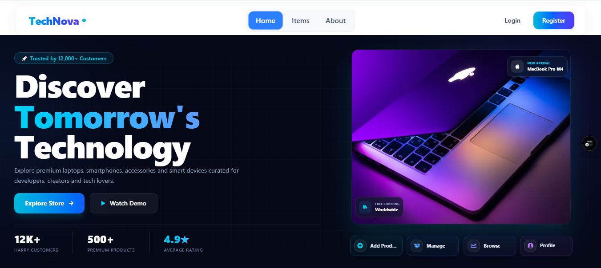
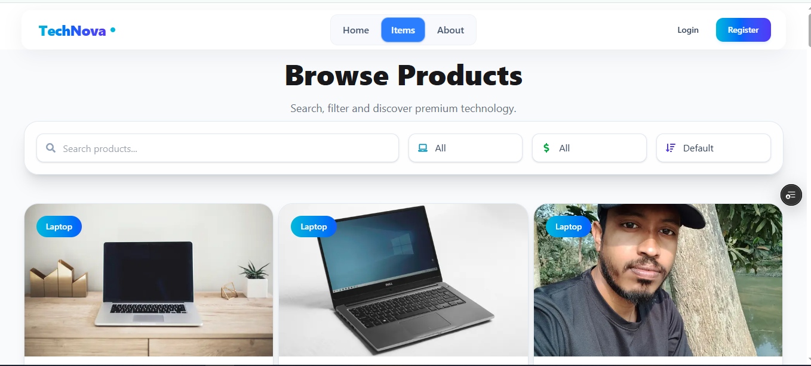
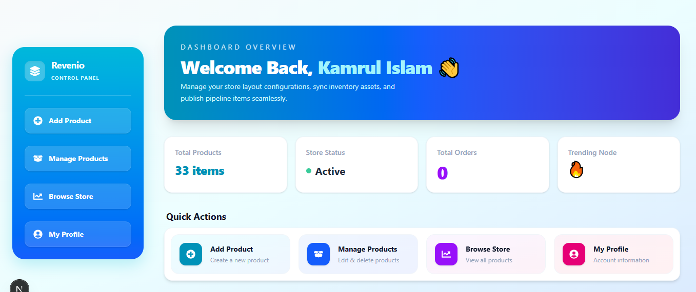

# 🛍️ Revenio Store

A modern full-stack e-commerce web application built with **Next.js**, **Express.js**, **MongoDB Atlas**, and **Firebase Authentication**. Users can browse products, securely authenticate, and manage products through a responsive dashboard.

---

## 🌐 Live Demo

### Frontend

https://revenio-client.vercel.app

### GitHub Repository

https://github.com/kamrul397/revenio-store

### Backend API

## https://revenio-server.onrender.com

## ✨ Features

- 🔐 Firebase Authentication
  - Email & Password Login
  - Google Sign-In
- 🛡️ Protected Routes
- 📦 Product Management (CRUD)
- 🔍 Search Products
- 🗂️ Category Filtering
- 💲 Price Filtering & Sorting
- ☁️ Cloudinary Image Upload
- 🔔 Toast Notifications
- ⚠️ SweetAlert2 Confirmation Dialogs
- 📱 Fully Responsive Design
- 🌙 Clean & Modern UI with Tailwind CSS & DaisyUI

---

## 🛠️ Tech Stack

### Frontend

- Next.js 16 (App Router)
- React
- Tailwind CSS
- DaisyUI
- Firebase Authentication
- React Toastify
- SweetAlert2
- React Icons

### Backend

- Node.js
- Express.js
- MongoDB Atlas
- CORS
- dotenv

### Deployment

- Vercel (Frontend)
- Render (Backend)
- MongoDB Atlas (Database)
- Cloudinary (Image Hosting)

---

## 📁 Project Structure

```text
revenio-store/
│
├── client/          # Next.js Frontend
│
├── backend/         # Express.js REST API
│
└── README.md
```

---

## 🚀 Getting Started

### Clone the Repository

```bash
git clone https://github.com/kamrul397/revenio-store.git
cd revenio-store
```

---

## 💻 Frontend Setup

```bash
cd client
npm install
npm run dev
```

Frontend runs at:

```
http://localhost:3000
```

---

## ⚙️ Backend Setup

```bash
cd backend
npm install
npm start
```

or

```bash
npm run dev
```

Backend runs at:

```
http://localhost:5000
```

---

## 🔑 Environment Variables

### Frontend (`client/.env.local`)

```env
NEXT_PUBLIC_API_URL=
NEXT_PUBLIC_FIREBASE_API_KEY=
NEXT_PUBLIC_FIREBASE_AUTH_DOMAIN=
NEXT_PUBLIC_FIREBASE_PROJECT_ID=
NEXT_PUBLIC_FIREBASE_STORAGE_BUCKET=
NEXT_PUBLIC_FIREBASE_MESSAGING_SENDER_ID=
NEXT_PUBLIC_FIREBASE_APP_ID=
NEXT_PUBLIC_FIREBASE_MEASUREMENT_ID=

NEXT_PUBLIC_CLOUDINARY_CLOUD_NAME=
NEXT_PUBLIC_CLOUDINARY_UPLOAD_PRESET=
```

---

### Backend (`backend/.env`)

```env
PORT=5000

DB_USER=
DB_PASS=

CLIENT_URL=http://localhost:3000
```

For production:

```env
CLIENT_URL=https://revenio-client.vercel.app
```

---

## 📸 Screenshots

### Home Page



### Products



### Dashboard



---

## 📌 Future Improvements

- Shopping Cart
- Wishlist
- User Profile
- Product Reviews & Ratings
- Order Management
- Payment Gateway Integration
- Admin Dashboard
- Pagination
- Dark Mode

---

## 👨‍💻 Author

**Kamrul Islam**

GitHub:
https://github.com/kamrul397

LinkedIn:
https://www.linkedin.com/in/kamrul397/

---

## ⭐ Support

If you like this project, consider giving it a ⭐ on GitHub!
